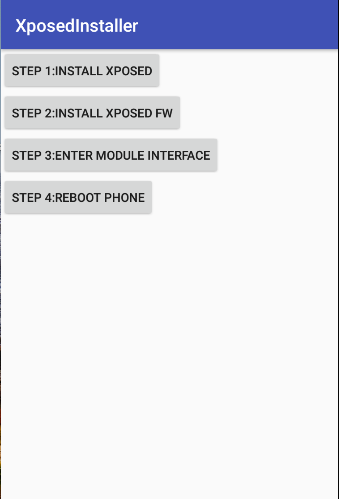
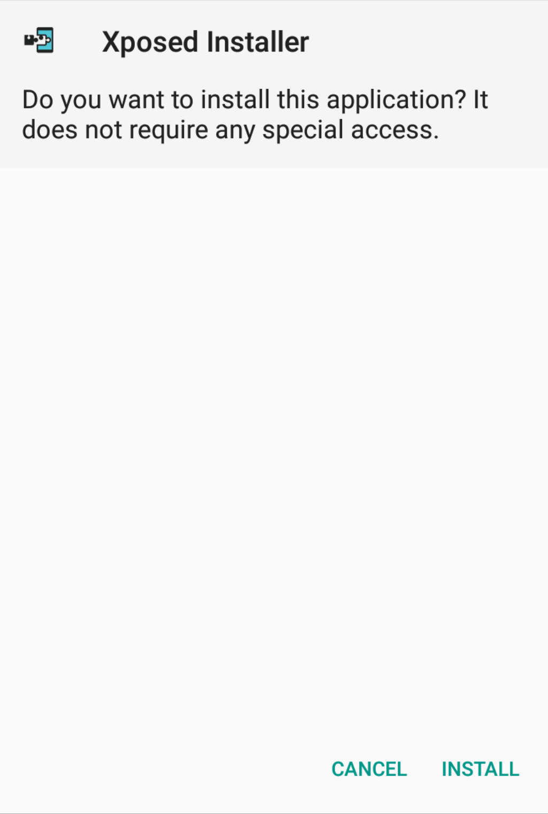
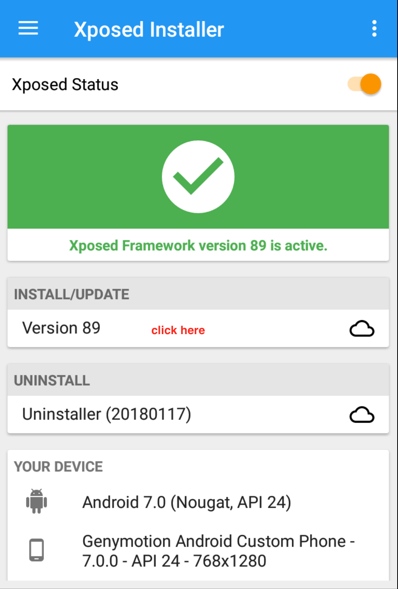
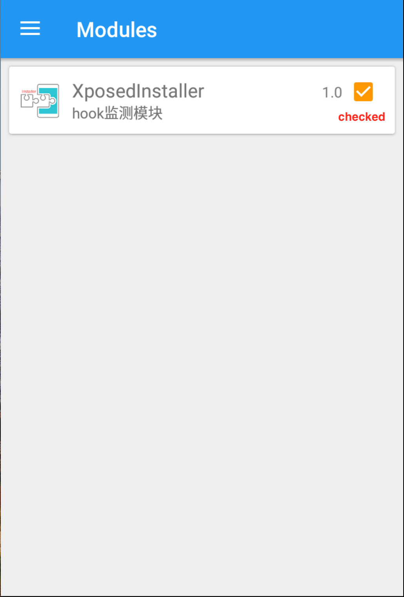

# XposedInstalled
help every one to install xposed

## 1.intall the XposedInstaller app then open it -> enter below paged:

## 2.click the Install xposed button -》 click install

## 3.click Install xposed fw->enter below paged

## 4.click the enter module interface button-> enter below page

## 5.install the HookDemo app

## 6.reboot the phone

## 7.enter HookDemo app

## 8.click the button(call the hooked method)

## 9.will output the log:(Successful)

	11-16 05:38:09.944 1917-1917/com.xpc.hookdemo I/Xposed: before hooked method called
	11-16 05:38:09.944 1917-1917/com.xpc.hookdemo V/HookedMethod: origin value:input String
	11-16 05:38:09.944 1917-1917/com.xpc.hookdemo I/Xposed: after hooked method called